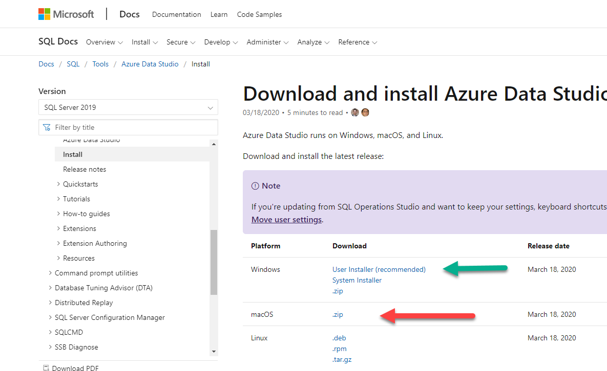
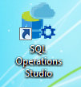
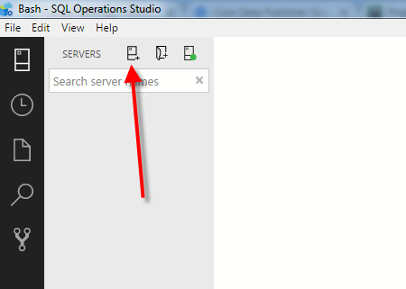
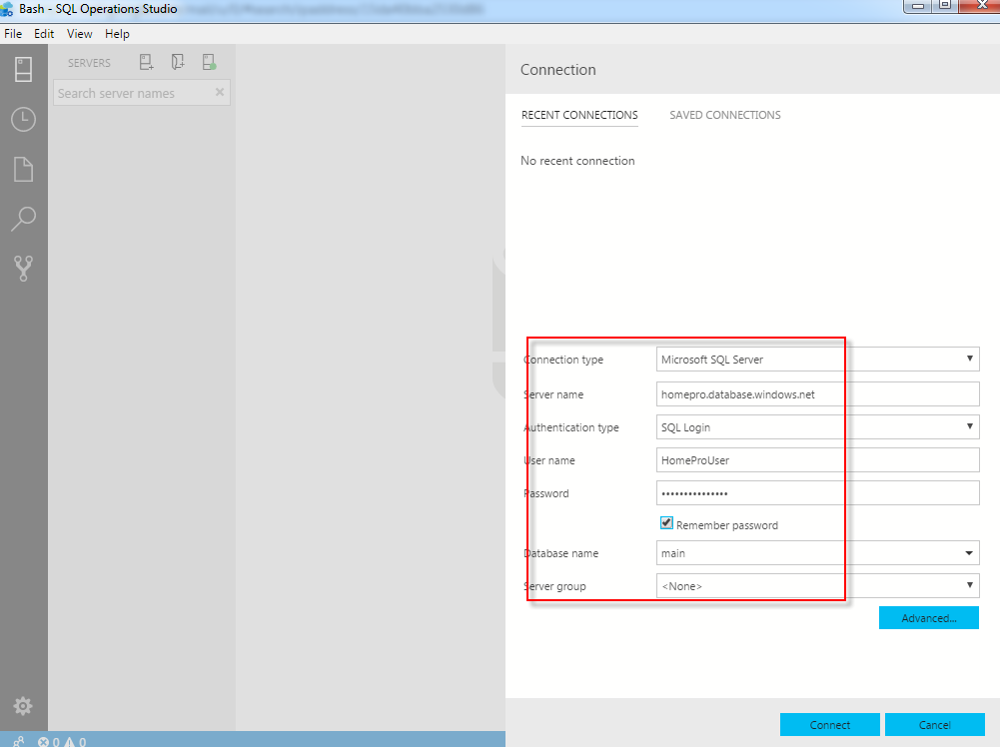
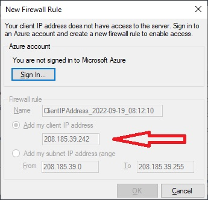
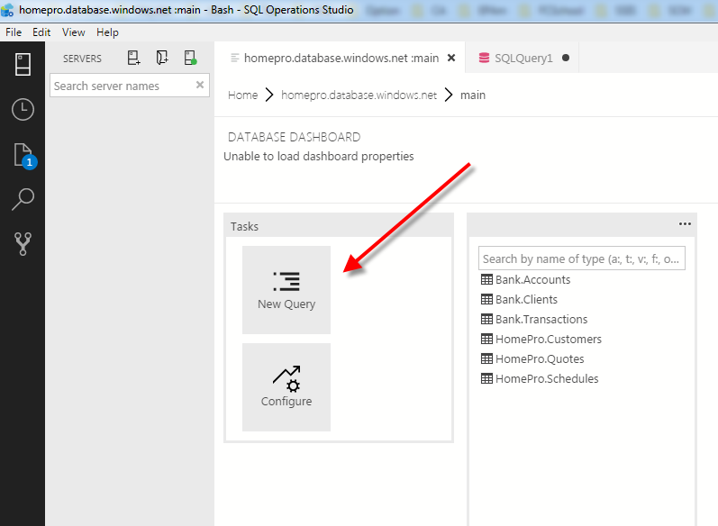
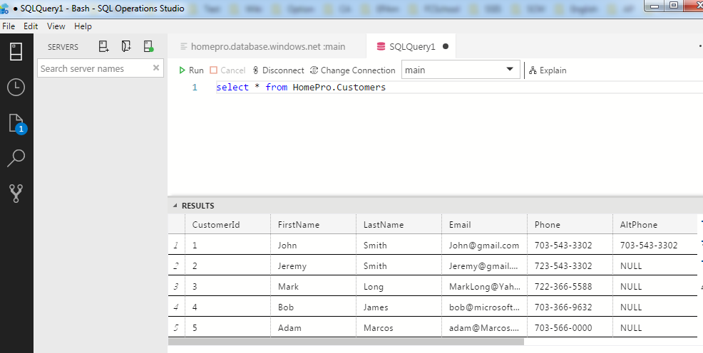

# Download and install Azure Data Studio
Go to URL: https://docs.microsoft.com/en-us/sql/azure-data-studio/download-azure-data-studio?view=sql-server-ver15
 
Clink on the link highlighted below to download installation that suits your operation system.

# First Login

As soon as installation finished, you should be able to see the icon like this one. 
 

 
Go and launch Azure Data Studio.

As soon as ADS started you will be prompted to fill login information. 
If not Push the button <b>“New connection”</b>

Please fill the fields as depicted at picture below.
- Server Name: <b>homepro.database.windows.net</b>
- Authentication Type: <b>SQL Login</b>
- Login: <b>HomeProUser</b>
- Password: <b>qwerty_123</b>
- Database Name: <b>main</b>

Push the button <b>“Connect”</b>.

## Possible Firewall connection issue.
If you see the message like at the picture below, then you have your IP address blocked by security firewall. 
- Send "My IP address" to via email andrew.a4100@gmail.com. (4 numbers separated by dots).
- As soon as I added your IP address to the whitelist I will respond you.
- After that you will be able to connect to database.

# Execute SQL queries.
Having successful login you must see picture like below. Push the button “New query”.

Type SQL query like below and the button <b>“Execute”</b>:
	
<b>select * from HomePro.Customers</b>

You should see picture like this.

Congratulations! You have successfully connected to Database, executed SQL query and can proceed with SQL assignments. 
- [Database Schema HomePro](./Lesson1/Schema%20HomePro.pdf)
- [Database Schema Bank](./Lesson1/Schema%20Bank.pdf)
