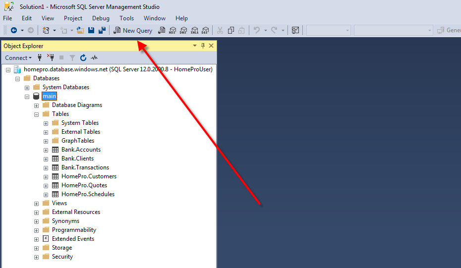
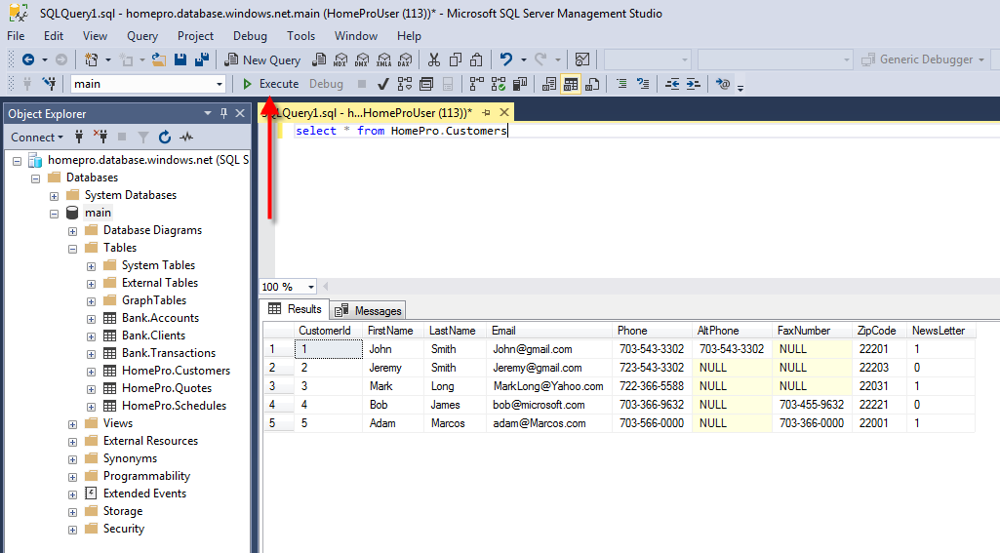

# Download and install SQL Server Management Studio
Go to URL: https://docs.microsoft.com/en-us/sql/ssms/download-sql-server-management-studio-ssms
 
Clink on the link highlighted below to download SSMS installation

As soon as the file downloaded start installation process. During installation you have to push only one button “Install”. 

# First Login

When installation finished go to <b>Start-> Microsoft SQL Server Tools 17->Microsoft SQL Server Management Studio 17</b> and launch SSMS.

You will be prompted to fill login information. Please fill the fields as depicted at picture below.
- Server Name: <b>homepro.database.windows.net</b>
- Login: <b>HomeProUser</b>
- Password: <b>qwerty_123</b>
- Push button “Options” for additional options.

On tab “Connection Properties” type “Connect to database”: <b>main</b>. 
Push the button “Connect”.

# Execute SQL queries

Having successful login you must see picture like below. You can see “Object Explorer” which shows Database main and at least 6 tables: 
- Bank.Accounts 
- Bank.Clients 
- Bank.Transactions 
- HomePro.Customers
- HomePro.Quotes
- HomePro.Schedules,

Push button “New Query” 

Type SQL query like below and the button <b>“Execute”</b>:
	
<b>select * from HomePro.Customers</b>

You should see picture like this.

Congratulations! You have successfully connected to Database, executed SQL query and can proceed with SQL assignments. 
- [Sample database HomePro](./Lesson1/HomePro%20Example.pdf)
- [Sample database Bank](./Lesson1/Bank%20Example.pdf)

