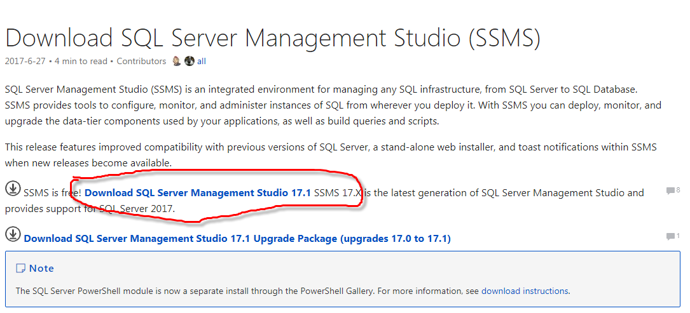
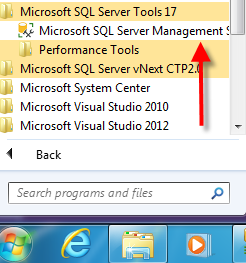
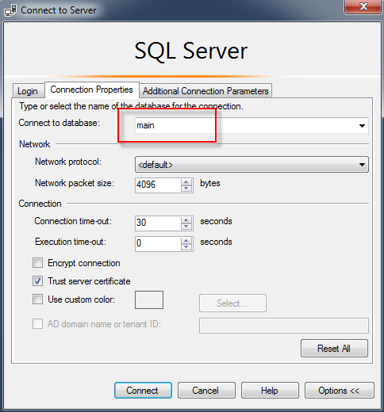

#Download and install SQL Server Management Studio
Go to URL: https://docs.microsoft.com/en-us/sql/ssms/download-sql-server-management-studio-ssms
Clink on the link highlighted below to download SSMS installation

As soon as the file downloaded start installation process. During installation you have to push only one button “Install”. 

#First Login

When installation finished go to <b>Start-> Microsoft SQL Server Tools 17->Microsoft SQL Server Management Studio 17</b> and launch SSMS.

You will be prompted to fill login information. Please fill the fields as depicted at picture below.
Server Name: homepro.database.windows.net 
Login: HomeProUser
Password: qwerty_123
Push button “Options” for additional options.

On tab “Connection Properties” type “Connect to database”: main. 
Push the button “Connect”.

#SQL queries.
Having successful login you must see picture like below. You can see “Object Explorer” which shows Database main and at least 6 tables: 
Bank.Accounts, Bank.Clients, Bank.Transactions, 
HomePro.Customers, HomePro.Quotes, HomePro.Schedules,
Push button “New Query” 
