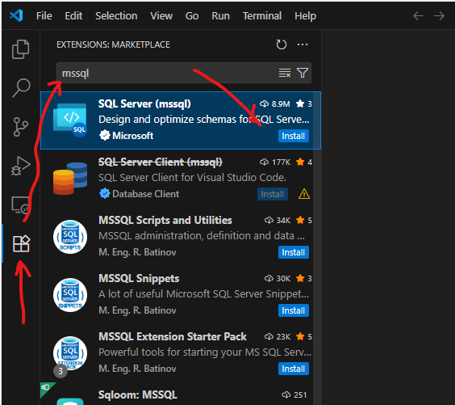
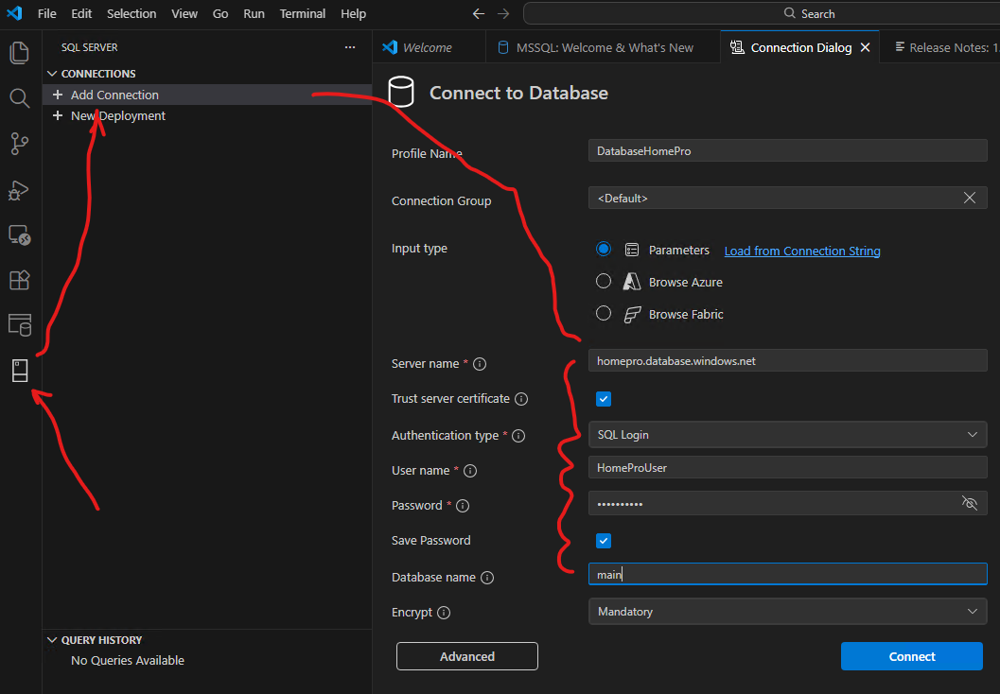
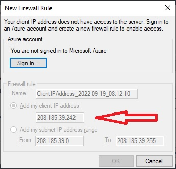
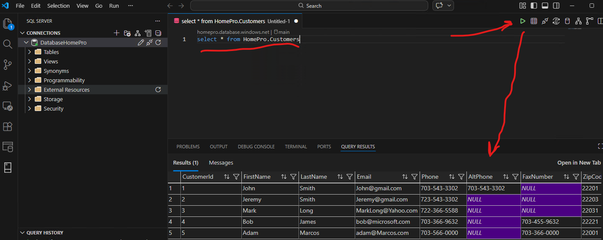

# Visual Studio Code Installation and Configuration

## 1. Install VS Code 
 
Download and install <b>Visual Studio Code</b>: https://code.visualstudio.com/download

## 2. Install the extention SQL Server "mssql"
 
As soon as installation finished.

- Start VS Code 
- Go to Extention Marketplace at the tool box
- Find extention SQL Server. Type: <b>mssql</b>
- Push <b>Install</b>
 

## 3. Connect to Database 
 
As soon as extention <b>mssql</b> installed.

- Go to SQL Server toolbox (Ctrl+Alt+D)
- Click <b>+ Add Connection</b>
- Fill the connection information as follows.

| Field        | Value           |
| ------------- | :-------------|
| Profile Name      | <b>DatabaseHomePro</b> |
| Server name       | <b>homepro.database.windows.net</b>|
| Trust server certificate | - [X]|
| Authentication Type | <b>SQL Login</b>|
| User name | <b>HomeProUser</b>|
| Password | <b>qwerty_123</b>|
| Save Password| <b>True</b> |
| Database Name| <b>main</b>|

Push <b>Connect</b>

## 4 Possible Firewall connection issue.
 
If you see the message like at the picture below, then you have your IP address blocked by security firewall. 

- Send "My IP address" to via email andrew.a4100@gmail.com. (4 numbers separated by dots).
- As soon as I added your IP address to the whitelist I will respond you.
- After that you will be able to connect to database.

## 5 Execute SQL queries.
 
Having successful login you must see picture like below. 

- Go to <b>SQL Server</b> 
- Click on connection and <b>DatabaseHomePro</b> chose <b>New query</b>.
- Type SQL query like below and the button <b>“Execute”</b>:
	
<b>select * from HomePro.Customers</b>

Congratulations! You have successfully connected to Database, executed SQL query and can proceed with SQL assignments. 
- [Database Assigments](./Lesson1/Assigment_Lesson_1.md)

